# Project Roadmap: local-llm

This document summarizes the history and planned direction of the `local-llm` project (https://github.com/epittman23/local-llm): a privacy-focused, self-hosted inference stack intended to eliminate reliance on cloud AI providers for agentic coding, math, statistics, and data analysis workloads, while remaining migratable between cloud and local backends through an OpenAI-compatible interface at every stage ("build once, migrate later").

The "Major changes to date" section is drawn from the repository itself (commit history, `CLAUDE.md`'s decisions log, and `README.md`). The "Planned future additions" section reflects direction that has been discussed but not yet implemented in code. Target dates for future work are loose estimates, not committed deadlines; see the Assumptions section at the end for how they were derived.

## Timeline

The diagram below is rendered from [roadmap-timeline.mmd](roadmap-timeline.mmd),
which is the canonical source (kept in sync with the Decisions log per the
maintenance policy in `CLAUDE.md`); the block here is a copy, since GitHub's
Markdown renderer has no way to transclude an external file into a fenced
mermaid diagram.

```mermaid
timeline
    title local-llm: Past Milestones and Planned Direction
    section Cloud Prototype (Jul 2026)
      2026-07-18 : Project scaffolded against OpenRouter : custom Python CLI, per-session memory, and JSONL usage logging : Qwen2.5-Coder-32B (coding) and DeepSeek-R1-Distill-Qwen-32B (reasoning)
      2026-07-20 : Custom React and FastAPI chat frontend added
      2026-07-21 : Custom frontend and backend retired in favor of Open WebUI, run via Docker
    section Local Inference Begins (Aug 2026)
      2026-08-17 : llama.cpp stood up on the laptop's RTX 3060 (6 GB) : Qwen3.6-35B-A3B MoE served via --n-cpu-moe as a parallel evaluation track
      2026-08-23 : Automated GPU telemetry : -ot tensor pinning for Qwen3.8-27B : MTP speculative decoding enabled : llama-test harness added : critical --parallel slot-count bug found and fixed
      2026-08-24 : First multi-prompt MTP speculative decoding measurement, 91.9% acceptance
      2026-08-30 : Correctness benchmarking added against HumanEval, MBPP, and DS-1000 : SQLite-backed results store (llama.db) : Textual terminal dashboard (llama-ui)
    section Hardening and Tooling (Sep 2026)
      2026-09-04 : qwen25c VRAM-resident profile added : system-prompt A/B testing capability added : five defects from a pre-merge code review fixed
      2026-09-05 : Statistical reporting command (llama-report) added with paired significance testing : server build specification finalized ($1,316.10 of a $2,000 ceiling)
      2026-09-06 : Textual dashboard replaced by a browser dashboard (llama-web) reachable behind a Caddy reverse proxy at the same port as Open WebUI
      2026-09-07 : qwen3c serving profile completed and documented
      2026-09-07 : Open WebUI forked and pinned (v0.11.3, git submodule, never merged) : Postgres+pgvector replaces SQLite/Chroma : lllm-frontend/lllm-backend run as host processes, Caddy retired : shell tooling reorganized under scripts/shell/, re-prefixed lllm-
      2026-09-08 : lllm-test/lllm-compare/lllm-report/lllm-tune/lllm-web suite migrated into the Open WebUI fork as its own Benchmarks section : logs/llama.db backfilled into Postgres and retired : CLI fully retired
    section Near-Term
      "~1 week" : Resolve the blocking rack hole-type question : confirm riser and PSU questions : re-verify current component pricing
    section Short-Term
      "~1-2 months" : Purchase and provision the R730 and V100 server : run the five acceptance tests : migrate Qwen3.8-27B to fully VRAM-resident serving
    section Medium-Term
      "~6 months" : Add math and statistics benchmark coverage : stand up Tailscale network exposure : evaluate a second V100 : watch for a Qwen3.8-35B-A3B release
    section Long-Term
      "~2 years" : Network-accessible household inference backend behind Open WebUI : early groundwork for smart-home integration
```

## Major changes to date

### Phase 1: Cloud prototype (July 2026)

- **2026-07-18**: The project began as a cloud-hosted prototype against OpenRouter's OpenAI-compatible API. A custom Python CLI provided per-session conversation memory and per-query JSONL usage logging for cost and performance comparison. Two task-specific models were selected: `qwen/qwen-2.5-coder-32b-instruct` for coding and `deepseek/deepseek-r1-distill-qwen-32b` for math, statistics, and reasoning, with `qwen/qwq-32b` as an alternate reasoning candidate for A/B evaluation. Both models were chosen specifically because they are realistically self-hostable later on a single high-VRAM consumer GPU, establishing the "build once, migrate later" principle from day one.
- **2026-07-19**: Both original reasoning candidates (`deepseek-r1-distill-qwen-32b` and `qwq-32b`) were confirmed removed from OpenRouter's catalog. Both were replaced with `qwen/qwen3-32b`, collapsing the planned A/B comparison to a single model until a genuinely different alternative could be identified.
- **2026-07-20**: A custom web frontend replicating Claude.ai's interface (assistant-ui, Bun, React) was added, backed by a new FastAPI server. The Python project was reorganized under a `backend/` directory to support this.
- **2026-07-21**: The custom frontend and backend were deleted entirely and replaced with Open WebUI, run in Docker and connected directly to OpenRouter. This was a deliberate simplification: a generic, actively maintained chat interface was judged easier to maintain long-term than bespoke frontend and backend code, and Open WebUI's support for any OpenAI-compatible endpoint preserved the project's cloud-to-local migration story without needing any custom code.

### Phase 2: Local inference foundations (August 2026)

- **2026-08-17**: Local inference was stood up for the first time, using llama.cpp's `llama-server` on the laptop's RTX 3060 (6 GB VRAM) as a parallel track to the OpenRouter/Open WebUI setup. Qwen3.6-35B-A3B (a sparse mixture-of-experts model, ~3B parameters active per token) was chosen specifically because its sparse activation pattern makes offloading expert tensors to system RAM (`--n-cpu-moe`) tolerable, which would not be true of a dense model of similar size. A thread sweep found generation throughput RAM-bandwidth bound rather than core bound, settling on 6 threads as the default.
- **2026-08-23**: Local serving matured substantially in a single day. GPU telemetry began recording automatically for every serving run; the dense Qwen3.8-27B profile gained tensor pinning (`-ot`) to keep the output projection and final block GPU-resident regardless of layer offload; MTP speculative decoding was enabled from the model's own draft head; and the `llama-test` harness was added to send version-controlled prompts against the running server for repeatable comparisons. A critical measurement bug was also found and fixed: `--parallel 1` had been bundled inside the speculative-decoding flag group, so disabling speculative decoding for a baseline comparison silently reset the server to four concurrent slots, systematically inflating the measured benefit of speculative decoding. All prior speculative-versus-baseline comparisons were discarded rather than adjusted.
- **2026-08-24**: The first reliable, multi-prompt measurement of MTP speculative decoding on Qwen3.8-27B was recorded: generation held 2.87-3.00 tokens/second with 91.9% draft acceptance across four prompts, confirming the earlier single-prompt figure was representative.
- **2026-08-30**: Local serving configurations began being judged on answer correctness, not only speed, reversing an earlier position that scoring was out of scope. Three published benchmarks with their own ground truth (HumanEval, MBPP sanitized, and DS-1000) were integrated, each benchmark's own reference solutions were calibrated against this environment's library versions to avoid mis-scoring, and results moved from ad hoc log files into a SQLite database (`logs/llama.db`) with full statistical detail. A Textual terminal dashboard (`llama-ui`) was added over the shell tooling. A known coverage gap was documented explicitly: coding and data analysis are measured, but math and statistics, two of the project's four primary use cases, are not.

### Phase 3: Hardening, statistics, and tooling consolidation (September 2026)

- **2026-09-04**: A third serving profile (`qwen25c`, a 7.6B dense model fully resident in 6 GB of VRAM) was added as the first local model whose throughput is not bound by system-RAM bandwidth. `llama-test` gained the ability to attach a system prompt as part of a measurement's identity, enabling controlled system-prompt comparisons. A pre-merge code review found and fixed five defects, the most significant being an under-reporting bug in the multi-flag comparison warning that could report a false all-clear when two configurations actually differed in context size, cache type, or expert offload count.
- **2026-09-05**: A statistical reporting command (`llama-report`) was added, applying paired significance testing (Cochran's Q, exact McNemar, Wilson intervals, Holm correction, and minimum-detectable-effect analysis) rather than simple ranking. Its first real analysis, a system-prompt ablation, returned a null result and, more importantly, demonstrated that the experiment's sample size could not have detected a meaningful difference at all: no effect size in the design would have been found with 80% probability. A GPU thermal-throttling event partway through the run was identified and explicitly excluded from throughput comparisons rather than silently averaged in. Separately, the server hardware build (Dell PowerEdge R730 chassis with an NVIDIA Tesla V100 PCIe 32GB) was fully specified and validated, totaling $1,316.10 against a $2,000 budget ceiling.
- **2026-09-06**: The Textual terminal dashboard was retired in favor of a browser-based dashboard (`llama-web`), reachable at the same port as Open WebUI through a Caddy reverse proxy, so that chat and the serving, testing, and tuning tooling are usable from a single browser tab.
- **2026-09-07**: The `qwen3c` serving profile (Qwen3-Coder-30B-A3B) was corrected and fully documented after being found reachable in practice but invisible to the project's own discovery tooling, a violation of the project's own maintenance policy that was caught and corrected the same day.
- **2026-09-07** (second): The 2026-09-06 decision against forking Open WebUI was reversed. Auth, the plugin system, and licensing all carry over unchanged at the moment of forking; the real cost is upstream drift, which a pinned, never-merged fork sidesteps by policy. Open WebUI is now a git submodule (`open-web-ui/openwebui`, forked to `epittman23/open-webui`, pinned at `v0.11.3`) and runs as two host processes, `lllm-frontend` and `lllm-backend`, rather than in Docker — the same shape `lllm-serve`/`lllm-web` already use, chosen specifically so the two can eventually integrate directly (deferred, not done here). Storage moved from SQLite/Chroma to Postgres+pgvector, started fresh rather than migrated. Caddy was retired (no longer needed once each process binds its own port), and the shell tooling was reorganized to `scripts/shell/` with every command re-prefixed `llama-` → `lllm-`. Full detail in `CLAUDE.md`'s decisions log.
- **2026-09-08**: The deferred integration named above landed: the entire `lllm-test`/`lllm-compare`/`lllm-report`/`lllm-tune`/`lllm-web` suite — benchmark running, grading, config comparison, statistical reporting, and configuration-search tuning — was migrated out of this repo and into the Open WebUI fork itself, as a new admin-only "Benchmarks" section (its own sidebar entry and seven pages, mirroring the fork's own routing/component/i18n conventions exactly). The CLI and the standalone `lllm-web` dashboard are retired outright; `logs/llama.db` was backfilled into the fork's own Postgres (fifteen new `benchmark_`-prefixed tables) and retired in turn. Full detail in `CLAUDE.md`'s decisions log.

## Planned future additions

The items below reflect intended direction rather than committed code changes, and the timeframes are loose estimates rather than formally committed deadlines. They are ordered by how soon they are likely to be acted on.

| Horizon     | Approximate timeframe | Planned item                                                                                                                                                                                                                                                                                                                                                                                                                                                                                                                                                                                                                                                                                                                                  |
| ----------- | --------------------- | --------------------------------------------------------------------------------------------------------------------------------------------------------------------------------------------------------------------------------------------------------------------------------------------------------------------------------------------------------------------------------------------------------------------------------------------------------------------------------------------------------------------------------------------------------------------------------------------------------------------------------------------------------------------------------------------------------------------------------------------- |
| Near-term   | ~1 week               | Resolve the three open server-build questions: confirm the R730's installed riser cards, confirm the rack's hole type (the one blocking question, since it determines whether an adapter bracket kit is needed for the rails), and confirm whether Dell's 1100W PSU requirement is firmware-enforced or advisory.                                                                                                                                                                                                                                                                                                                                                                                                                             |
| Short-term  | ~1-2 months           | Purchase and provision the Dell PowerEdge R730 and Tesla V100 32GB once the blocking question above is resolved and current pricing is re-verified (used-GPU and DDR5 prices have been rising through 2026). Run the five documented acceptance tests (card identity, memory health, a 30-minute sustained thermal test, a throughput benchmark against RTX 3090 reference figures, and a tool-calling regression check) inside the return window. Migrate Qwen3.8-27B from the laptop's CPU-offloaded configuration to fully VRAM-resident serving on the V100, which removes the dense-architecture penalty that makes it unusable as a coding assistant on the current laptop.                                                             |
| Medium-term | ~6 months             | Close the known math and statistics benchmark gap (for example, by adding a GSM8K or MATH adapter alongside the existing HumanEval, MBPP, and DS-1000 adapters). Stand up network-accessible inference behind Tailscale as the primary exposure method (Cloudflare Tunnel remains the evaluated fallback) so the server can be reached from other devices without opening ports. Evaluate a second Tesla V100 using the roughly $684 of remaining budget headroom from the original build. Continue watching for a Qwen3.8-35B-A3B mixture-of-experts release, which appears to be in preparation based on Alibaba's `ms-swift` commit history, as a potential drop-in upgrade to the MoE daily-driver model.                                 |
| Long-term   | ~2 years              | Build out a network-accessible household inference backend with Open WebUI as the shared frontend, reachable from any device on the Tailscale network. Begin early groundwork toward smart-home integration (for example, using a low-power appliance node running Home Assistant as an orchestration layer). This has been explicitly treated as a multi-year horizon that should not drive today's hardware decisions, since both the model landscape and the software stack are expected to shift substantially before it becomes a priority; note also that the V100's NVIDIA driver support (R580 LTSB branch) is scheduled to end in August 2028, which loosely bounds this card's useful life and roughly coincides with this horizon. |

## Assumptions and notes

- **Timeline dates in the "major changes" section** are taken directly from the dated entries in `CLAUDE.md`'s decisions log and cross-checked against `README.md`; they reflect when a change was recorded, which is very close to when it was made in the project's own commit workflow.
- **Timeframes in the "planned future additions" section are estimates, not commitments.** They were derived from the known sequencing and dependencies between items (for example, the server purchase is blocked on one open question, and the smart-home work is a deliberate multi-year horizon), mapped onto loose bands (about a week, about one to two months, about six months, about two years). Treat any item without a firmer date as unresolved until one is set.
- **The "1-2 months" and "6 months" bands are not immune to market conditions.** Component prices (used RTX 3090s, DDR5) have been rising through 2026; if that trend continues, the short-term hardware purchase could shift later or the build could be revised.
- This document is a standalone summary of the repository's history and its intended direction as of September 7, 2026, and does not modify anything else in the repository.